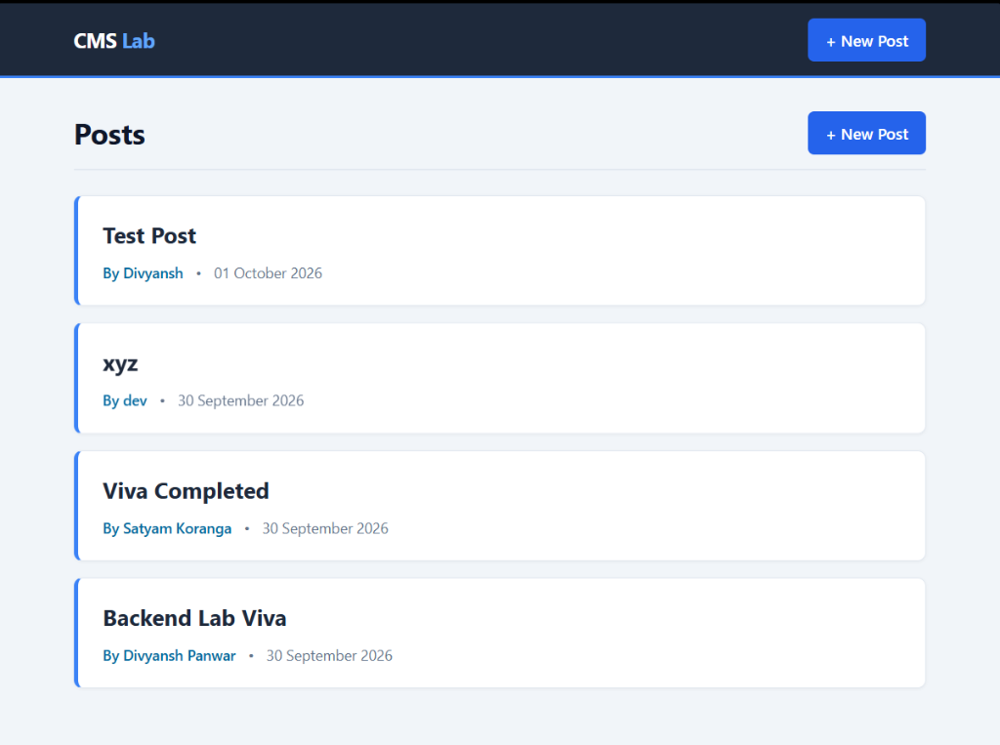
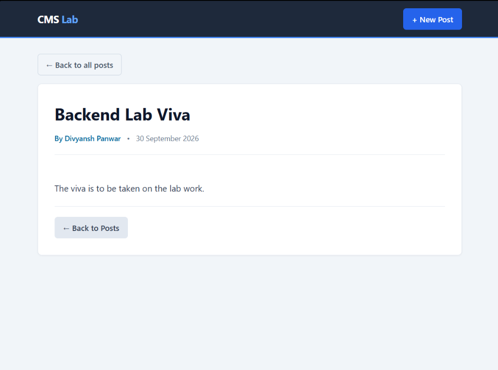
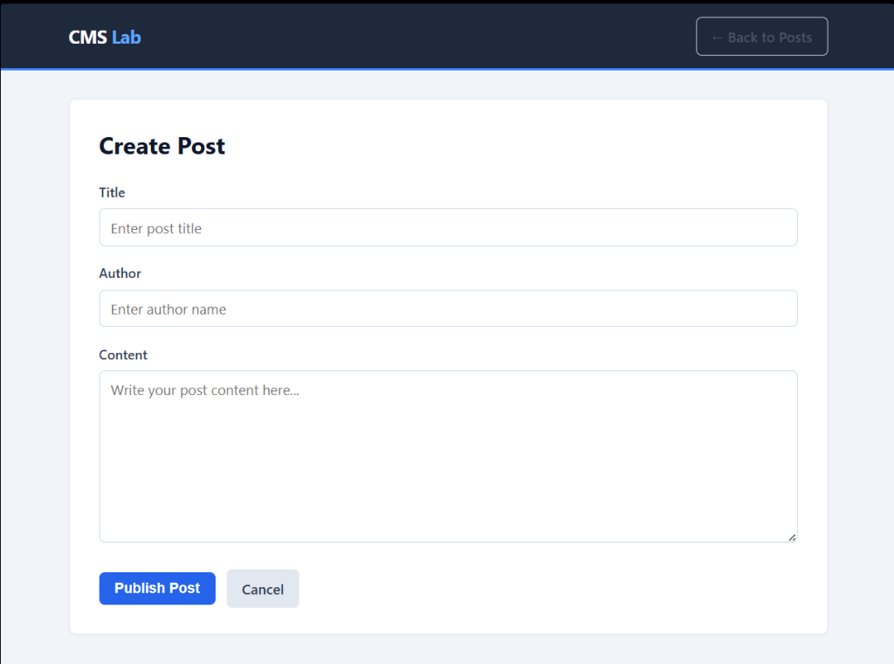
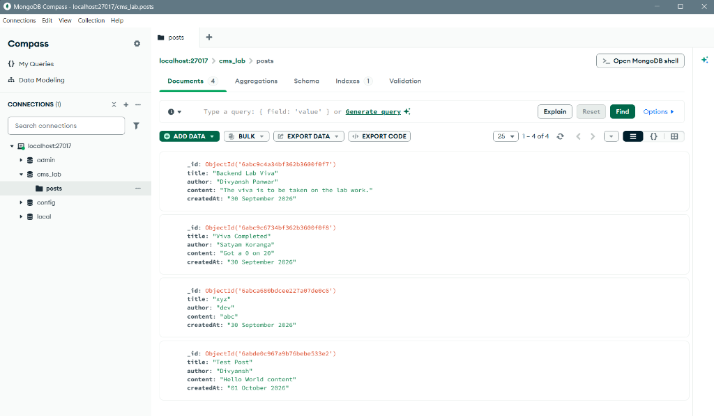

# Simple CMS Blog Application

**Student Name:** Divyansh Panwar  
**Course:** Backend Development Lab  
**Project:** Blog Content Management System (Simple CMS)  
**Technology Stack:** Python (Flask), Jinja2 Templates, MongoDB (PyMongo)  

---

## Project Overview

A complete Blog Content Management System (CMS) developed for the Backend Development Lab Examination according to the official examination specification (Option B).

The application allows users to create blog posts, display all posts in reverse chronological order with server-generated timestamps, and read full articles by clicking on their titles. Data is persistently stored in MongoDB.

---

## Application Screenshots

### 1. Posts List (Homepage)
Displays all published posts in reverse chronological order (newest first). Only metadata (title, author, date) is loaded; full content is omitted on this view as per specification.



---

### 2. View Individual Post
Displays the full content of a selected post retrieved by its MongoDB unique identifier (`ObjectId`).



---

### 3. Create New Post
Form allowing authors to input the post title, author name, and content. The creation timestamp is automatically generated on the backend and cannot be tampered with.



---

### 4. MongoDB Database (MongoDB Compass)
Verification of persistent storage in the local MongoDB database (`cms_lab` database, `posts` collection) showing auto-assigned ObjectIds and timestamps.



---

## Features and Requirements Implemented

1. **Display All Posts (`GET /` and `GET /posts`)**
   * Retrieves all posts sorted in reverse chronological order (`.sort('_id', -1)`).
   * Displays post **Title**, **Author**, and **Creation Date** (formatted as `DD Month YYYY`).
   * Post titles are clickable links navigating to the full post view (`/posts/<id>`).
   * Optimized query: Full content is excluded from the listing query (`{'title': 1, 'author': 1, 'createdAt': 1}`).

2. **Create a Post (`GET /posts/new` and `POST /posts`)**
   * Dedicated creation form with inputs for Title, Author, and Content.
   * Input validation: Ensures all fields are non-empty after trimming whitespace.
   * Server-side timestamp: Creation date and time is automatically assigned on the server (`datetime.now()`) and never accepted from client form input.
   * Automatic redirect to the post list upon successful creation.

3. **View Individual Post (`GET /posts/<id>`)**
   * Retrieves and renders the complete post document from MongoDB using its unique `ObjectId`.
   * Handles invalid or non-existent IDs gracefully with a clean "Post Not Found" view.

4. **Database Persistence**
   * Persists blog posts into a local MongoDB instance (`cms_lab` database, `posts` collection).
   * Automatically falls back to in-memory storage if MongoDB is not running, ensuring uninterrupted functionality.

---

## Directory Structure

```text
cms-lab/
├── app.py                      # Flask application routes and database logic
├── requirements.txt            # Python package dependencies
├── README.md                   # CMS Lab Documentation
│
├── static/
│   └── style.css               # Custom responsive CSS styling
│
├── templates/
│   ├── posts.html              # All posts listing template
│   ├── post.html               # Individual post detail template
│   └── new-post.html           # Create new post form template
│
└── screenshots/                # Application and database screenshots
    ├── posts-list.png          # Posts homepage view
    ├── view-post.png           # Single post view
    ├── create-post.png         # Create post form view
    └── mongodb-compass.png     # MongoDB Compass database view
```

---

## Routes Implemented

| HTTP Method | Route | Description |
| :--- | :--- | :--- |
| `GET` | `/` | Redirects / displays all blog posts in reverse chronological order |
| `GET` | `/posts` | Displays all blog posts in reverse chronological order |
| `GET` | `/posts/new` | Renders the HTML form to create a new post |
| `POST` | `/posts` | Validates submitted form data, adds server timestamp, and saves to MongoDB |
| `GET` | `/posts/<id>` | Retrieves and displays the full post by its MongoDB ObjectId |

---

## How to Run the Application

### 1. Prerequisites
* Python 3.10 or higher
* MongoDB Community Server 7.x / 8.x

### 2. Install Dependencies
```bash
pip install -r requirements.txt
```

### 3. Start MongoDB Server
Ensure MongoDB is running locally on default port `27017`:
```bash
mongod --dbpath C:\Users\divya\mongodb_data
```

### 4. Start the Flask Server
```bash
python app.py
```

### 5. Access in Browser
Navigate to:
```
http://127.0.0.1:5000
```
